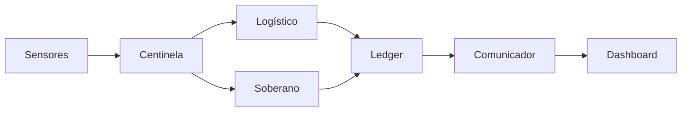

# AGIGOV

**Sistema Operativo del Estado** — agentes institucionales 24/7, ledger inmutable y dashboards ciudadanos.


AGIGOV convierte funciones de Estado hoy discrecionales y opacas (ejecución presupuestaria, conteo de votos, liberación de fondos de proyectos públicos) en procesos **verificables, auditables y ejecutados automáticamente** por un enjambre de agentes de IA sobre un ledger inmutable. No es un modelo de lenguaje ni una demo de IA — es infraestructura de gobierno con evidencia criptográfica en el centro.

> **Para quién:** gobiernos e instituciones que necesitan mostrar resultados con evidencia, no discurso; desarrolladores que quieren construir sobre un protocolo de gobernanza abierto; ciudadanos que quieren verificar en vez de confiar en la palabra de un funcionario.

## Arquitectura



Disputas: **conciliador** (grafo de confianza). Incidentes: **centinela** FREEZE + intervención humana obligatoria. Ver [AGENTS.md](AGENTS.md) para la arquitectura completa y las convenciones técnicas.

## Demo sin instalar el backend

Tras `npm run dev`, la consola de ejecución presupuestaria se recorre sola:

**http://localhost:3000/modelos/egs/consola?demo=1**

Muestra un cierre de demostración y la secuencia del análisis (pensar → procesar → resultado). No usa Postgres. El dato está etiquetado como demostración.

## Estructura del repositorio

| Ruta | Qué es |
|------|--------|
| `src/citizen/` | PWA ciudadana e institucional |
| `src/agents/`, `src/bus/`, `src/protocol/` | Enjambre de agentes, bus soberano, protocolo IAP firmado |
| `src/db/`, `prisma/`, `prisma-edge/` | Ledger (Postgres) y nodos edge offline-first (SQLite) |
| `src/edge/`, `src/ingest/` | Nodos territoriales, ingesta LoRaWAN |
| `infra/` | Docker Compose, WireGuard, Mosquitto, despliegue |
| `docs/` | Documentación completa — empieza en [docs/README.md](docs/README.md) |
| `.github/agents/` | Equipo de expertos (subagentes) para cerrar el PRE-LAUNCH PILOT |

## Quickstart

Interfaz, sin Docker ni base de datos (Node.js ≥ 22):

```bash
npm install
npm run dev            # PWA → http://localhost:3000
# demo EGS → http://localhost:3000/modelos/egs/consola?demo=1
npm run lint            # tsc --noEmit
npm run build            # build de producción
```

API y ledger locales (Docker + Postgres):

```bash
cp .env.example .env
npm run infra:up:dev
npm run db:generate && npm run db:migrate && npm run db:seed
npm run api:public       # :3001 — el proxy de Vite apunta aquí
npm run agents:flow      # demo del pipeline completo
```

Detalle por nivel: [docs/GETTING-STARTED.md](docs/GETTING-STARTED.md) · [docs/SETUP-GUIA-MAC.md](docs/SETUP-GUIA-MAC.md) · [infra/README.md](infra/README.md).

Qué entra al espejo público y qué se queda en este repo: [docs/OSS-PUBLIC-SCOPE.md](docs/OSS-PUBLIC-SCOPE.md).

## Documentación

- **[docs/README.md](docs/README.md)** — índice maestro de toda la documentación.
- **[docs/AGIGOV/README.md](docs/AGIGOV/README.md)** — el modelo AGIGOV: concepto, plan, economía, seguridad.
- **[docs/AGIGOV/MODEL-MANIFEST-v1.md](docs/AGIGOV/MODEL-MANIFEST-v1.md)** — cómo publicar una Aplicación de Estado en el catálogo (`/modelos`).
- **[docs/PLAN-EJECUCION-FASES.md](docs/PLAN-EJECUCION-FASES.md)** — roadmap por fases con criterios de cierre.

## Contribuir

Este repositorio está en fase **PRE-LAUNCH PILOT** (privado, acceso por invitación). Antes de tu primer PR, lee:

1. [CONTRIBUTING.md](CONTRIBUTING.md) — flujo de contribución, cómo levantar el entorno.
2. [CODE_OF_CONDUCT.md](CODE_OF_CONDUCT.md) — estándares de la comunidad.
3. [SECURITY.md](SECURITY.md) — reporte responsable de vulnerabilidades (nunca en issues públicos).

## Licencia

Núcleo de la plataforma bajo [Apache License 2.0](LICENSE). Las Aplicaciones de Estado del catálogo pueden declarar su propia licencia (ver [Model Manifest v1](docs/AGIGOV/MODEL-MANIFEST-v1.md)). Términos de uso adicionales del repo/API: [docs/TERMS-OF-USE.md](docs/TERMS-OF-USE.md).
