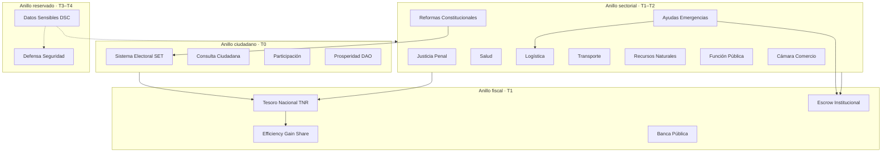

# Investigación — Modelos AGIGOV para el aparato estatal completo

Documento de **investigación fundamental**: define cómo cada función del Estado se traduce en un **modelo de servicio AGIGOV** replicable — con problema, propósito, vitalidad, modelo de negocio, modelo operacional, capa de confidencialidad y relación con modelos ya existentes.

**Alcance:** protocolo genérico AGIGOV · sin jurisdicción piloto en el texto.  
**Estado:** investigación v1 — no implica implementación en UI ni seed demo.  
**Complementa:** [MODELOS-SERVICIOS.md](./MODELOS-SERVICIOS.md) (10 modelos actuales) · [CONCEPTO.md](./CONCEPTO.md)

---

## 1. Marco metodológico

Todo dominio estatal en AGIGOV se diseña con la **misma plantilla validada**:

| Dimensión | Pregunta que responde |
|-----------|----------------------|
| **Problema** | ¿Qué ineficiencia, opacidad o riesgo estructural existe hoy? |
| **Propósito** | ¿Qué hace el modelo en una frase operativa? |
| **Vitalidad** | ¿Por qué el Estado no puede postergarlo sin perder legitimidad o control fiscal? |
| **Negocio** | ¿Quién paga, cómo se monetiza/sostiene, qué métrica define éxito? |
| **Operación** | ¿Qué agentes intervienen, cuál es el flujo, qué evidencia queda? |
| **Confidencialidad** | ¿Qué tier de datos aplica (ver §2)? |
| **Interdependencias** | ¿De qué otros modelos depende o alimenta? |

Pipeline institucional universal (sin excepción):

```
received → validated → decided → committed → published
```

- Escrituras irreversibles solo en `committed` con firmas verificadas.
- UI pública solo en `published` (o agregados anonimizados).
- **Centinela** puede ejecutar `FREEZE` ante irregularidad; human-in-the-loop antes de des-congelar.

---

## 2. Capas de confidencialidad (tiers)

No todo el Estado puede ser “ledger público”. AGIGOV separa **verificabilidad** de **publicidad**:

| Tier | Nombre | Ejemplos | Publicación |
|------|--------|----------|-------------|
| **T0** | Telemetría pública | KPIs gestión, agregados electorales | Dashboard ciudadano |
| **T1** | Institucional compartido | Contratos, hitos escrow, presupuesto agregado | Contraloría + ministerios |
| **T2** | Sensible regulado | Salud agregada, nómina agregada, litigio metadata | Rol + dictamen soberano |
| **T3** | Alta confidencialidad | Expediente penal, inteligencia policial, claves bancarias | Compartimentos cifrados · multi-sig |
| **T4** | Defensa / reservado | Operaciones militares, aeroespacial clasificado | Nodos air-gapped · sin PWA pública |

El modelo transversal **DSC** (§4) implementa T2–T4; los demás modelos declaran qué tier usan.

---

## 3. Arquitectura: tres anillos del Estado



**Tesoro (TNR)** es el **hub fiscal**: ningún pago sectorial debería ejecutarse fuera de su conciliación con EGS + Escrow + Banca Pública.

---

## 4. Modelo transversal — Datos Sensibles y Alta Confidencialidad (DSC)

**Nombre comercial:** *Compartimento Soberano de Datos*  
**ShortName:** DSC  
**Tier:** T2–T4 (infraestructura)

### Problema
El Estado concentra datos críticos (penal, salud, defensa, banca) en silos opacos **o** los expone mal en sistemas “transparentes” que filtran PII. No hay estándar de need-to-know verificable.

### Propósito
Proveer **shards de ledger cifrados**, acceso por roles DID, auditoría centinela sin contenido en claro, y publicación selectiva de **hashes/commitments** hacia T0/T1.

### Por qué es vital
Sin DSC, los modelos sectoriales o filtran demasiado (impunidad) o filtran de menos (espionaje interno, re-identificación). Es la precondición técnica del Estado moderno verificable **y** seguro.

### Modelo de negocio
| Campo | Valor |
|-------|-------|
| Pagador | Presupuesto central TI / ciberseguridad + fee por compartimento activo |
| Mecanismo | Licencia anual por dominio (justicia, defensa, salud…) + auditoría continua |
| Métrica | 0 incidentes de exfiltración · 100% accesos T3+ con traza firmada |

### Modelo operacional
| Campo | Valor |
|-------|-------|
| Agentes | Centinela · Soberano · guardian-cuantico (PQC) |
| Flujo | Clasificación → compartimento → acceso multi-sig → commit hash → agregado publicable |
| Evidencia | Log de acceso firmado · hash del expediente · dictamen de publicación parcial |

### Beneficios clave
- Separación estricta T0 público vs T3 sellado
- **Blind audit**: contraloría verifica que existió acto sin ver contenido
- FREEZE por compartimento (no todo el Estado cae)
- Interoperabilidad IAP entre compartimentos con consentimiento normativo

---

## 5. Modelo hub — Tesoro Nacional (TNR)

**Nombre comercial:** *Tesoro Soberano Verificable*  
**ShortName:** TNR  
**Tier:** T1 (movimientos agregados T0)

### Problema
Tesorería opera con conciliación manual, pagos duplicados, anticipos sin trazabilidad y cierre fiscal no reproducible entre ministerio, banco público y contraloría.

### Propósito
Ser el **único punto de verdad** para obligaciones, pagos, cobros y cierre diario/mensual — integrando Escrow, EGS, Banca Pública y pagos sectoriales.

### Por qué es vital
Todo ministerio depende del flujo de caja. Sin TNR unificado, EGS y Escrow son islas; la corrupción migra al “gasto fuera de partida”.

### Modelo de negocio
| Campo | Valor |
|-------|-------|
| Pagador | Estado (presupuesto central) |
| Mecanismo | Incluido en despliegue AGIGOV; fee operador sobre ahorro EGS vinculado |
| Métrica | % pagos con evidencia de hito · días de desfase conciliación bancaria |

### Modelo operacional
| Campo | Valor |
|-------|-------|
| Agentes | Centinela · Logístico · Soberano · Comunicador |
| Flujo | Compromiso presupuestario → reserva TNR → orden pago → confirmación banco → Q-Close |
| Evidencia | Asiento contable firmado · hash cadena pagos · acta cierre multi-sig |

### Interdependencias
Alimenta y consume: **EGS**, **Escrow**, **BPS**, **FPT** (nómina), **AEE** (emergencias), todos los sectores.

---

## 6. Catálogo sectorial — modelos propuestos

### 6.1 Sistema Judicial y Penal (SJP)

**Nombre:** *Justicia Verificable y Cadena de Custodia Penal*

| Dimensión | Contenido |
|-----------|-----------|
| **Problema** | Expedientes manipulables, cadena de custodia rota, plazos procesales opacos, sobre-población carcelaria sin métrica pública. |
| **Propósito** | Registrar actos procesales, evidencia física/digital y resoluciones con cadena de custodia criptográfica; publicar **estadísticas** (T0) sin PII (T3). |
| **Vitalidad** | Sin confianza judicial no hay Estado de derecho; la impunidad destruye legitimidad más que la mala política fiscal. |
| **Negocio** | Pagador: poder judicial / ministerio justicia. Licencia por jurisdicción + integración tribunales. Métrica: plazos cumplidos · integridad cadena custodia. |
| **Operación** | Soberano (marco) · Centinela (irregularidades) · Conciliador (disputas) · Comunicador (stats). Flujo: denuncia → expediente T3 → audiencias → sentencia hash → ejecución penal. |
| **Tier** | T3 expedientes · T0 estadísticas agregadas |
| **Relación** | DSC obligatorio · TNR para multas/compensaciones · SET no aplica directo |

---

### 6.2 Reformas Constitucionales (RCV)

**Nombre:** *Protocolo de Reforma Constitucional Verificable*

| Dimensión | Contenido |
|-----------|-----------|
| **Problema** | Reformas opacas, quórum disputado, consultas sin estándar técnico, riesgo de captura legislativa. |
| **Propósito** | Pipeline normativo: propuesta → dictamen soberano → votación legislativa multi-sig → **referendum SET** → promulgación con acta inmutable. |
| **Vitalidad** | La constitución es el contrato social; alterarla sin trazabilidad es golpe de estado lento. |
| **Negocio** | Pagador: poder constituyente / congreso. Fee por proceso de reforma + módulo SET referendo. Métrica: cierre sin incidente centinela · participación verificada. |
| **Operación** | Soberano · Centinela · Comunicador. Flujo: borrador → comisiones → plenaria firmada → referendo SET → texto promulgado hash-linked. |
| **Tier** | T1 actos legislativos · T0 resultados referendo |
| **Relación** | **SET** (referendo) · **Participación** (consulta previa) · **Gestión verificable** (publicación) |

---

### 6.3 Cámara de Comercio (CCR)

**Nombre:** *Registro Mercantil y Confianza B2G*

| Dimensión | Contenido |
|-----------|-----------|
| **Problema** | Empresas fantasma en licitaciones, beneficiarios finales ocultos, duplicidad de registros, fricción para PYMEs formales. |
| **Propósito** | DID empresarial, registro verificable, estado de licencias y elegibilidad para **Escrow** y **Evidencia API**. |
| **Vitalidad** | El Estado compra a quien existe en papel; CCR conecta economía real con contratación pública trazable. |
| **Negocio** | Pagador: cámaras / registro mercantil + fee anual empresa + tier API integradores. Métrica: licitaciones con proveedor verificado ↑ · fraude registro ↓. |
| **Operación** | Logístico · Centinela · Comunicador. Flujo: registro → verificación → estado activo → webhook a Escrow al licitar. |
| **Tier** | T1 registro · T2 beneficiario final (compartimento) |
| **Relación** | **Escrow** · **Evidencia API** · **Data Trust** (agregados sectoriales) |

---

### 6.4 Logística Estatal (LGE)

**Nombre:** *Logística Pública Trazada*

| Dimensión | Contenido |
|-----------|-----------|
| **Problema** | Inventarios fantasma, desvío de insumos, rutas opacas, dependencia de hojas de cálculo en crisis. |
| **Propósito** | Inventario soberano multi-almacén, movimientos IoT/edge, hitos Escrow ligados a entrega física verificada. |
| **Vitalidad** | Salud, emergencias y defensa civil colapsan sin logística visible; aquí muere la corrupción material. |
| **Negocio** | Pagador: ministerios + operador logístico. Fee por nodo almacén + % sobre valor movido verificado. Métrica: discrepancia inventario físico vs ledger. |
| **Operación** | Logístico · Centinela · Comunicador. Flujo: recepción → almacén → despacho → confirmación territorial → hito Escrow. |
| **Tier** | T1 movimientos · T0 agregados suministro |
| **Relación** | **Escrow** · **AEE** · **SPV** (medicamentos) · **TME** (flota) |

*Nota:* el agente institucional **logístico** ya existe en AGIGOV; LGE es su producto ministerial empaquetado.

---

### 6.5 Salud Pública Verificable (SPV)

**Nombre:** *Salud Soberana con PHI Compartimentada*

| Dimensión | Contenido |
|-----------|-----------|
| **Problema** | Historias clínicas filtradas o inaccesibles en emergencia; compras medicamentos opacas; epidemiología sin datos confiables. |
| **Propósito** | PHI en compartimento T3; cadena frío vacunas; compras públicas en Escrow; telemetría epidemiológica T0 agregada. |
| **Vitalidad** | Salud es monopolio estatal inevitable; opacidad mata (desabastecimiento) y filtrar PII destruye confianza. |
| **Negocio** | Pagador: ministerio salud + seguros públicos. Licencia por red hospitalaria + módulo DSC. Métrica: stock crítico trazado · 0 brechas PHI auditadas. |
| **Operación** | Logístico · Centinela · Soberano (protocolos clínicos). Flujo: prescripción T3 → dispensación → factura Escrow → agregado cobertura T0. |
| **Tier** | T3 clínico · T1 compras · T0 epidemiología k-anon |
| **Relación** | **DSC** · **LGE** · **Escrow** · **AEE** (pandemias) |

---

### 6.6 Transporte y Movilidad (TME)

**Nombre:** *Movilidad e Infraestructura Verificable*

| Dimensión | Contenido |
|-----------|-----------|
| **Problema** | Peajes y subsidios mal focalizados; mantenimiento vial sin hitos; contratos concesión opacos. |
| **Propósito** | Telemetría flota pública, hitos mantenimiento en Escrow, subsidios tarjeta con anti-fraude centinela. |
| **Vitalidad** | Transporte es arteria económica; cada desvío fiscal en concesión es regresión distributiva. |
| **Negocio** | Pagador: ministerio transporte + concesionarios. Fee por km verificado / contrato concesión activo. Métrica: costo por km vs baseline EGS. |
| **Operación** | Logístico · Centinela · Comunicador. Flujo: licitación → obra Escrow → apertura tramo → telemetría T0. |
| **Tier** | T1 contratos · T0 uso agregado |
| **Relación** | **EGS** (obras) · **Escrow** · **TNR** (subsidios) |

*Sinergia con EGS existente:* obras viales son caso de uso demo natural del cierre trimestral.

---

### 6.7 Ayudas Sociales y Emergencias (AEE)

**Nombre:** *Respuesta Humanitaria y Ayudas con Escrow de Crisis*

| Dimensión | Contenido |
|-----------|-----------|
| **Problema** | Ayudas duplicadas, captura política de subsidios, desastres con donaciones sin trazabilidad, desfase horas críticas. |
| **Propósito** | Registro elegibilidad T2, desembolso TNR rápido, paquetes LGE trazados, activación PANIC_MODE y nodos edge offline. |
| **Vitalidad** | En terremoto o sequía, opacidad = muerte; ciudadanía exige prueba de entrega no PowerPoint. |
| **Negocio** | Pagador: Estado + donantes multilaterales. Fee de coordinación sobre fondo gestionado + EGS sobre ahorro logístico crisis. Métrica: tiempo entrega · duplicidad detectada. |
| **Operación** | Logístico · Centinela · Comunicador · Conciliador (disputas territorio). Flujo: declaración emergencia multi-sig → fondo Escrow → despacho LGE → confirmación receptor. |
| **Tier** | T2 elegibilidad · T0 mapa entregas agregado |
| **Relación** | **Escrow** · **LGE** · **TNR** · **DAO** (donaciones ciudadanas) |

---

### 6.8 Banca Pública Soberana (BPS)

**Nombre:** *Banca Pública Conciliada con Ledger*

| Dimensión | Contenido |
|-----------|-----------|
| **Problema** | Bancos estatales desconectados de tesorería; créditos políticos sin cobranza; imposible conciliar saldo real vs contabilidad. |
| **Propósito** | Mirror ledger de movimientos bancarios (no reemplaza core banking día 1); conciliación diaria TNR; créditos programáticos con Escrow. |
| **Vitalidad** | Banca pública mueve el dinero real; sin conciliación el Tesoro es ficción contable. |
| **Negocio** | Pagador: entidad bancaria estatal. Licencia integración + fee por cuenta conciliada. Métrica: desfase conciliación horas → minutos. |
| **Operación** | Centinela · Logístico · Soberano (marco crediticio). Flujo: instrucción TNR → ejecución banco → webhook asiento → Q-Close. |
| **Tier** | T3 cuentas · T1 agregados · T0 telemetría prudencial |
| **Relación** | **TNR** (obligatorio) · **Escrow** · **EGS** |

---

### 6.9 Recursos Naturales (RNR)

**Nombre:** *Regalías y Concesiones Verificables*

| Dimensión | Contenido |
|-----------|-----------|
| **Problema** | Extracción ilegal, regalías sub-declaradas, concesiones sin control ambiental, conflictos territoriales opacos. |
| **Propósito** | Permisos multi-sig, sensores IoT producción, regalías auto-calculadas hacia TNR, evidencia ambiental en Escrow. |
| **Vitalidad** | Recursos naturales financian al Estado; opacidad aquí es soberanía vendida. |
| **Negocio** | Pagador: ministerio energía/minas + operadores. % sobre regalía verificada vs declarada tradicional. Métrica: delta declarado vs sensor. |
| **Operación** | Centinela · Soberano · Logístico · Comunicador. Flujo: concesión → producción IoT → factura regalía → TNR → auditoría T0. |
| **Tier** | T2 contratos · T0 producción agregada |
| **Relación** | **TNR** · **Escrow** · **CCR** (operadores) · **Conciliador** (conflictos territorio) |

---

### 6.10 Sistema Electoral Tokenizado (SET)

**Estado:** ya definido en catálogo v1 · ver [MODELOS-SERVICIOS.md](./MODELOS-SERVICIOS.md) y [CNE-TOKENIZADO.md](./CNE-TOKENIZADO.md).

**Ampliación investigación — tiers electorales:**

| Tier | Proceso | Modelo |
|------|---------|--------|
| E1 | Consulta deliberativa barrial | Consulta Ciudadana (SET lite) |
| E2 | Referendo / reforma | RCV + SET |
| E3 | Elección nacional | SET pleno + DSC para Padrón T3 |
| E4 | Primarias partidarias | SET con jurisdicción privada CCR |

**Métrica universal:** 0 discrepancia recuento independiente vs ledger · FREEZE funcional en simulacro.

---

### 6.11 Función Pública y Trabajadores del Estado (FPT)

**Nombre:** *Empleo Público Meritocrático Verificable*

| Dimensión | Contenido |
|-----------|-----------|
| **Problema** | Nombramientos discrecionales, nómina fantasma, evaluación inexistente, ausencia métrica de desempeño. |
| **Propósito** | Vacantes publicadas, proceso selección trazable, nómina TNR integrada, evaluación agregada T0 sin exponer evaluación individual T3. |
| **Vitalidad** | El 30–50% del gasto corriente es función pública; opacidad aquí es clientelismo estructural. |
| **Negocio** | Pagador: ministerio trabajo / función pública. Licencia por entidad + ahorro EGS nómina duplicada detectada. Métrica: headcount verificado vs presupuesto. |
| **Operación** | Soberano · Centinela · Comunicador. Flujo: vacante → concurso → nombramiento multi-sig → alta TNR → evaluación periódica. |
| **Tier** | T3 expediente laboral · T0 plantilla agregada |
| **Relación** | **TNR** · **EGS** · **Participación** (denuncias nepotismo) |

---

### 6.12 Defensa, Seguridad Policial, Militar y Aeroespacial (DSS)

**Nombre:** *Compartimento Defensa y Seguridad Nacional*

| Dimensión | Contenido |
|-----------|-----------|
| **Problema** | Operaciones clasificadas no auditables internamente; compras defensa opacas; frontera entre policía y militar borrosa en cadena de mando. |
| **Propósito** | Nodos **air-gapped** T4; cadena mando firmada; compras defensa en Escrow T3; inteligencia solo hashes hacia contraloría especializada. |
| **Vitalidad** | Seguridad es monopolio estatal; opacidad total genera golpes y tráfico de armas — opacidad cero expone capacidades. AGIGOV busca **blind audit** no publicidad. |
| **Negocio** | Pagador: presupuesto defensa. Contrato soberano alto valor + integración DSC T4. Métrica: auditoría interna cerrada sin hallazgo material. |
| **Operación** | Centinela · Soberano · guardian-cuantico. Flujo: orden clasificada → ejecución compartimento → acta resumen multi-sig → TNR pago agregado. |
| **Tier** | T4 operaciones · T3 compras · T0 presupuesto agregado defensa |
| **Relación** | **DSC** (mandatorio) · **TNR** · **Escrow** · **LGE** (logística militar) |

**Principio AGIGOV:** la PWA ciudadana **nunca** expone T4; comunicador publica solo agregados autorizados por ley de transparencia sector defensa.

---

## 7. Matriz resumen

| ID | Modelo | Short | Tier | Pagador principal | Agente líder |
|----|--------|-------|------|-------------------|--------------|
| DSC | Datos Sensibles | DSC | T2–T4 | TI / Ciber | Centinela |
| TNR | Tesoro Nacional | TNR | T1 | Estado | Logístico |
| SJP | Justicia Penal | SJP | T3/T0 | Poder judicial | Conciliador |
| RCV | Reforma Constitucional | RCV | T1/T0 | Legislativo | Soberano |
| CCR | Cámara Comercio | CCR | T1/T2 | Registro mercantil | Logístico |
| LGE | Logística Estatal | LGE | T1 | Ministerios | Logístico |
| SPV | Salud Pública | SPV | T3/T0 | Salud | Logístico |
| TME | Transporte | TME | T1/T0 | Transporte | Logístico |
| AEE | Ayudas Emergencias | AEE | T2/T0 | Estado + donantes | Logístico |
| BPS | Banca Pública | BPS | T3/T1 | Banco estatal | Centinela |
| RNR | Recursos Naturales | RNR | T2/T0 | Energía/minas | Centinela |
| SET | Sistema Electoral | SET | T3/T0 | Autoridad electoral | Centinela |
| FPT | Función Pública | FPT | T3/T0 | Función pública | Soberano |
| DSS | Defensa Seguridad | DSS | T4/T3 | Defensa | Centinela |

**Modelos ya en catálogo v1** (reutilizar, no duplicar): EGS, Escrow, Gestión verificable, IaaU, Data Trust, Evidencia API, DAO, Participación, Consulta Ciudadana.

---

## 8. Validación operacional — checklist por modelo

Antes de promover un modelo de `investigación` → `beta` → `disponible`:

1. **Threat model** escrito (tactical-cybersecurity)
2. **Dictamen soberano** sobre conformidad constitucional / legal sector
3. **KPIs** medibles en 90 días de sandbox AGIGOV-SBX
4. **Rollback** definido (DESIGN-ROLLBACK.md)
5. **Multi-sig** identificado (quién firma actas)
6. **Tier DSC** asignado y probado con datos sintéticos
7. **Integración TNR** especificada (aunque sea stub)
8. **Demo seed** opcional — sin datos reales clasificados

---

## 9. Priorización sugerida (investigación → implementación)

| Ola | Modelos | Rationale |
|-----|---------|-----------|
| **Ola 0** (existente) | EGS · Escrow · Gestión · SET · Participación · DAO | Base fiscal y legitimidad |
| **Ola 1** | **TNR** · **DSC** · **LGE** · **CCR** | Hub fiscal + confianza B2G + logística transversal |
| **Ola 2** | **AEE** · **SPV** · **TME** · **FPT** | Servicios ciudadanos visibles + gasto corriente |
| **Ola 3** | **BPS** · **RNR** · **SJP** · **RCV** | Alta complejidad legal y financiera |
| **Ola 4** | **DSS** | T4 · infra air-gapped · auditoría clasificada |

---

## 10. Preguntas abiertas para siguiente iteración

1. ¿Un solo ministerio puede desplegar LGE sin TNR, o TNR es gate obligatorio?
2. ¿RCV siempre exige SET referendo o permite reformas solo legislativas con quórum superior?
3. ¿BPS es mirror ledger o evolución a CBDC programática sobre AGIGOV?
4. ¿DSS comparte hardware con nodos edge territoriales o exige enclave físico dedicado?
5. ¿Cámara de comercio es actor empresarial (audiencia empresarial) o gubernamental (registro)? — propuesta: **dual**, registro = gubernamental, API KYB = empresarial.

---

## 11. Referencias internas

| Documento | Uso |
|-----------|-----|
| [MODELOS-SERVICIOS.md](./MODELOS-SERVICIOS.md) | Catálogo implementado (10) |
| [CNE-TOKENIZADO.md](./CNE-TOKENIZADO.md) | Profundidad SET |
| [SEGURIDAD-PQC.md](./SEGURIDAD-PQC.md) | DSC / DSS |
| [ECONOMIA-DAO.md](./ECONOMIA-DAO.md) | AEE + DAO |
| `.cursor/agents/*.md` | Roles operativos |
| `.cursor/skills/applied-cryptography/` | Firmas, multi-sig, DID |
| `.cursor/skills/tactical-cybersecurity/` | PANIC, tiers, honeypots |

---

*Investigación v1 — Jul 2026. Siguiente paso recomendado: validar Ola 1 con stakeholders institucionales y extender `agigovModels.ts` solo tras ratificación soberana.*

---

## Investigación comercial — ganar-ganar, pricing y validación

Para **justificación por scorecard**, **beneficios por actor**, **5 capas de validación**, **unificación protocolo**, **escalabilidad**, **KPIs de utilización** y **libro de precios M1–M9**:

**[INVESTIGACION-NEGOCIO-GANAR-GANAR.md](./INVESTIGACION-NEGOCIO-GANAR-GANAR.md)**
