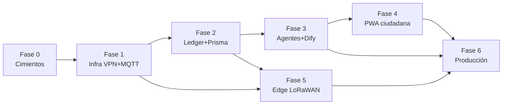
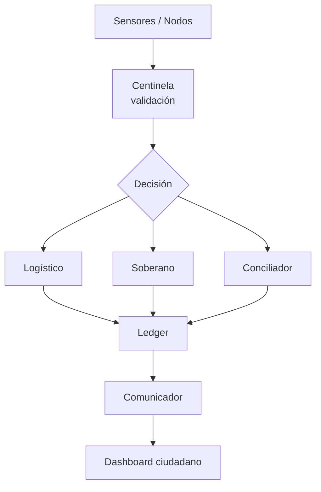
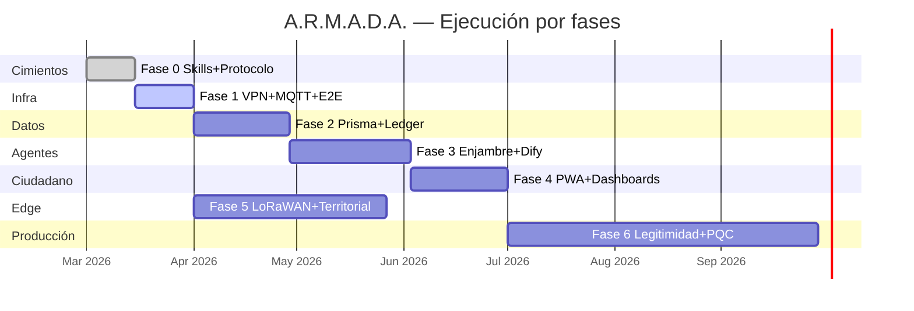

# Plan de Ejecución por Fases — A.R.M.A.D.A. VZLA

Roadmap operativo para convertir Armada de arquitectura teórica en sistema soberano desplegable. Cada fase tiene **entregables verificables**, dependencias claras y criterio de cierre antes de avanzar.

## Estado global (marzo 2026)

| Fase | Nombre | Estado | Progreso |
|------|--------|--------|----------|
| 0 | Cimientos del SO | Completada | 100% |
| 1 | Infra soberana local | En curso | 40% |
| 2 | Ledger y datos | En curso | 75% |
| 3 | Enjambre operativo | En curso | 70% |
| 4 | Interfaz ciudadana | Completada | 100% |
| 5 | Nodos territoriales | Completada | 100% |
| 6 | Producción y legitimidad | Pre-producción | 85% |

> **Validaciones diferidas:** pruebas que requieren hardware, cloud, VPN o soak prolongado (p. ej. 72h offline, LoRaWAN RF, despliegue Always Free real) se ejecutan al **cierre de Fase 6**, no bloquean entrega de código intermedio.

## Mapa de dependencias



## Pipeline transversal (todas las fases)



---

## Fase 0 — Cimientos del sistema operativo ✅

**Objetivo:** Definir capacidades técnicas, agentes institucionales y protocolos base.

### Entregables (hecho)

- [x] 7 Skills Cursor (cripto, devops, datos, agentes, ciberseguridad, PWA, IAP)
- [x] 5 agentes institucionales (`.cursor/agents/`)
- [x] Reglas de ejecución basada en evidencia
- [x] Protocolo IAP v1 (`src/protocol/`) — envelope cifrado + firmado
- [x] Bus soberano base (`src/bus/`) — MQTT worker, outbox SQLite, DID registry
- [x] `AGENTS.md` maestro

### Criterio de cierre

Agente puede handoff con `evidenceBundle` verificable sin inventar formatos paralelos.

---

## Fase 1 — Infraestructura soberana local 🔄

**Objetivo:** Red privada (WireGuard) + bus MQTT; worker conectado extremo a extremo.

**Duración estimada:** 1–2 semanas

### Entregables

- [x] `infra/docker-compose.yml` — WireGuard + Mosquitto (MQTT solo en VPN)
- [x] `infra/docker-compose.dev.yml` — Mosquitto local para desarrollo rápido
- [ ] Prueba E2E: peer WG → `npm run bus:worker` → mensaje IAP recibido
- [ ] Documentar rotación de claves DID en nodo
- [ ] `PANIC_MODE` probado con intent bloqueado en bus

### Comandos

```bash
# Desarrollo rápido (sin VPN)
docker compose -f infra/docker-compose.dev.yml up -d
MQTT_URL=mqtt://127.0.0.1:1883 npm run bus:worker

# Soberano (MQTT solo vía WireGuard)
docker compose -f infra/docker-compose.yml up -d
# Importar infra/wireguard/config/peer1/peer1.conf en cliente WG
# MQTT_URL=mqtt://10.8.0.1:1883 npm run bus:worker
```

### Criterio de cierre

Dos nodos con DIDs distintos intercambian envelopes IAP por MQTT sin exponer broker a internet público.

### Skill principal

`guerrilla-devops`, `inter-agent-protocol`, `tactical-cybersecurity`

---

## Fase 2 — Ledger y arquitectura de datos 🔄

**Objetivo:** Persistencia transaccional, grafo de confianza y sync offline-first.

**Duración estimada:** 3–4 semanas

**Depende de:** Fase 1

### Entregables

- [x] Schema Prisma core — ciudadanos, votos, escrow, actas, trust, ledger
- [x] Schema edge SQLite — SyncOutbox offline
- [x] Servicios ledger + `CONFLICT_RULES` (`src/db/`)
- [x] Replicator edge → core Postgres
- [x] Postgres en `docker-compose.dev.yml` + seed demo
- [ ] Prueba E2E local con Postgres activo (`db:demo-sync`)

### Comandos

```bash
npm run infra:up:dev
npm run db:generate && npm run db:migrate && npm run db:migrate:edge
npm run db:seed && npm run db:demo-sync
```

### Criterio de cierre

Voto registrado en edge offline → sync → centinela valida integridad → commit ledger.

### Skill principal

`resilient-data-architecture`, `applied-cryptography`

---

## Fase 3 — Enjambre operativo (agentes vivos) 🔄

**Objetivo:** Cada agente institucional procesa mensajes IAP con lógica real.

**Duración estimada:** 4–6 semanas

**Depende de:** Fase 2

### Entregables

| Agente | Handler | Integración |
|--------|---------|-------------|
| Centinela | `handlers/centinela.ts` | FREEZE + audit + commit escrow |
| Logístico | `handlers/logistico.ts` | Escrow + handoff centinela |
| Soberano | `handlers/soberano.ts` | Dictamen + actas |
| Conciliador | `handlers/conciliador.ts` | Trust graph |
| Comunicador | `handlers/comunicador.ts` | Métricas → published |

- [x] Handlers en `src/agents/handlers/`
- [x] Dispatcher + state machine + handoffs IAP
- [x] `run-worker.ts` con enjambre por `AGENT_ROLE`
- [x] Stubs Dify en `workflows/`
- [x] Demo pipeline: `npm run agents:flow`
- [ ] Despliegue multi-nodo MQTT (4 workers en paralelo)

### Comandos

```bash
# Demo local (Postgres + seed requeridos)
npm run agents:flow

# Worker por agente (terminales separadas, mismo MQTT)
AGENT_ROLE=centinela NODE_DID=did:armada:core:centinela npm run bus:worker
AGENT_ROLE=logistico NODE_DID=did:armada:core:logistico npm run bus:worker
```

### Criterio de cierre

Flujo completo automatizado: sensor simulado → centinela → logístico → ledger → comunicador.

### Skill principal

`agent-engineering`, `inter-agent-protocol`

---

## Fase 4 — Interfaz ciudadana (PWA táctica)

**Objetivo:** Dashboard legible en conexiones precarias; pedagogía del sistema.

**Duración estimada:** 3–4 semanas

**Depende de:** Fase 3 (datos publicados)

### Entregables

- [x] Service Worker + manifest PWA
- [x] Estados de red: offline | syncing | synced | error
- [x] Dashboard comunicador (telemetría → narrativa ciudadana)
- [x] Vistas de propuestas soberano (legal simplificado)
- [ ] Lighthouse PWA ≥ 90 en Slow 4G (validar en despliegue)

### Criterio de cierre

Ciudadano ve reporte de gestión actualizado tras commit en ledger, sin PII expuesta.

### Skill principal

`tactical-pwa`, `state-innovation`

---

## Fase 5 — Nodos territoriales y edge

**Objetivo:** Operación en municipios con cortes de red; LoRaWAN donde aplique.

**Duración estimada:** 4–8 semanas

**Depende de:** Fase 1 + Fase 2

### Entregables

- [x] Gateway LoRaWAN → ChirpStack → MQTT (payloads firmados)
- [x] Nodo edge: outbox SQLite + sync diferido
- [x] Despliegue Always Free (Oracle ARM / GCP e2-micro) — guías + compose
- [x] Backup off-site (rclone cron)
- [x] Equidad territorial: nodos periféricos ≠ segunda clase

### Validaciones diferidas (cierre Fase 6)

Pruebas que requieren hardware, cloud o soak prolongado — se ejecutan al culminar **todas** las fases:

- [ ] Soak 72h offline en VM edge real
- [ ] Gateway LoRaWAN físico + ChirpStack E2E en RF
- [ ] Despliegue Oracle/GCP con WireGuard al core
- [ ] Backup rclone a destino off-site real
- [ ] Centinela validando integridad post-sync periférico

Simulación dev disponible: `npm run test:offline-72h` (drenado de cola, no soak real).

Runbook: **[docs/FASE-5-NODOS-TERRITORIALES.md](FASE-5-NODOS-TERRITORIALES.md)**

### Criterio de cierre

Nodo territorial opera 72h offline, sincroniza al reconectar sin pérdida de votos/actas.

### Skill principal

`guerrilla-devops`, `resilient-data-architecture`, `tactical-cybersecurity`

---

## Fase 6 — Producción, legitimidad e innovación continua

**Objetivo:** Sistema nacional desplegable con auditoría 24/7 y marco normativo vivo.

**Duración estimada:** continua

**Depende de:** Fases 3, 4, 5

### Entregables

- [x] Whitepaper indexado en agente soberano
- [x] Centinela 24/7 + honeypots desplegados (compose + systemd)
- [x] Protocolo de pánico probado (FREEZE → rotación → recover) — `npm run panic:drill`
- [x] Ciclo `state-innovation` (briefs quincenales, pilotos acotados)
- [x] Plan PQC (guardian-cuantico) documentado

Runbook: **[docs/PRE-PRODUCTION.md](PRE-PRODUCTION.md)**

### Validaciones diferidas (cierre nacional)

- [ ] Acta de piloto nacional ratificada por multi-sig
- [ ] Dashboard público vs ledger sin discrepancias (auditoría centinela)
- [ ] Soak 72h edge + LoRaWAN RF + WireGuard E2E + rclone restore
- [ ] Lighthouse PWA ≥ 90 Slow 4G

### Criterio de cierre

Acta de piloto nacional ratificada por multi-sig; dashboard público refleja ledger sin discrepancias.

---

## Cronograma sugerido (Gantt)



---

## Riesgos y mitigaciones

| Riesgo | Mitigación |
|--------|------------|
| Broker MQTT expuesto | Solo WireGuard; sin puerto 1883 público en prod |
| Pérdida de claves DID | Rotación con solapamiento; backup cifrado offline |
| Sync conflictivo en votos | Inmutabilidad + rechazo duplicados por hash |
| LLM como fuente de verdad | Solo `evidenceBundle` verificable; human-in-the-loop |
| Free tier agotado | Multi-cloud plan B; sleep servicios no críticos |

---

## Próxima acción inmediata (Fase 1)

1. Levantar infra dev: `docker compose -f infra/docker-compose.dev.yml up -d`
2. `npm run bus:seed` y configurar `.env`
3. Terminal A: `npm run bus:worker` (centinela)
4. Terminal B: script de envío IAP hacia logístico
5. Verificar log de recepción + outbox vacío tras flush

Ver también: [infra/README.md](../infra/README.md)
