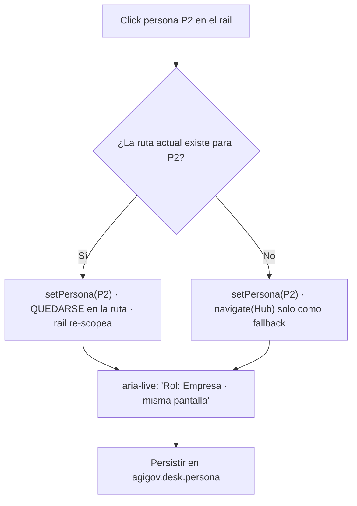
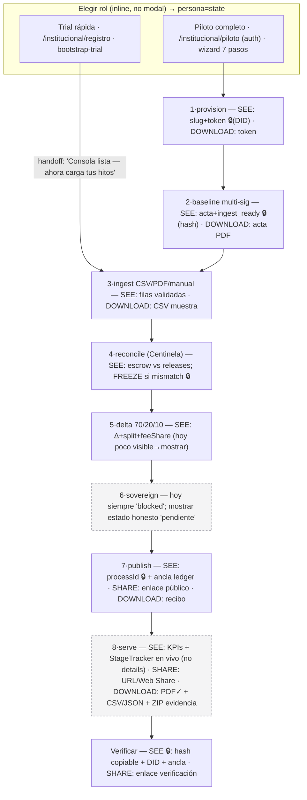

# OS + EGS — Desglose de la interfaz de usuario (end-user A→Z, versionado)

> **Objetivo.** Narrar el recorrido real del usuario final del OS soberano y de su modelo insignia **EGS**, paso a paso (A→Z), separando lo que el cliente quiere **ver / compartir / descargar** en cada paso. El desglose sirve para (1) detectar pasos, lógica, tecnología, procesos o UI/UX que faltan o están mal, y (2) dejar un plan **fácil de construir** por versiones.
>
> **Método.** Todo lo de "Estado actual" está anclado al código en `main` (rutas de archivo citadas). Lo de "Objetivo" es especificación. Cada brecha lleva la versión (`v1`…`v3`) en la que se corrige (§6).
>
> **Marca / tokens.** Se respeta `docs/design/OS-MINIMAL-TOKENS.md`: blanco, tinta zinc, borde `#e4e4e7`, azul `#0052ff` solo en marca, Lucide 16px stroke 1.5. Sin acentos cromáticos decorativos.

---

## 0. TL;DR — los tres arreglos que ordenan todo

1. **Barra de menú minimalista (estilo workspace de un IDE / bandeja tipo Gmail).** Hoy conviven **tres sistemas de navegación** que se solapan y se desincronizan (rail por persona, paleta ⌘K, nav/footer de landing). Unificar a: **un rail primario corto (persona-aware) + paleta ⌘K como "todo lo demás" + top bar delgado con contexto/búsqueda/cuenta**. → **v1** (§2).
2. **Una sola taxonomía de persona.** Hoy hay **dos** que no coinciden: landing/desk (`state · citizen · enterprise · integrator`) vs. modal de onboarding (`citizen · explorer · government · business`), y la elección del modal se descarta. Unificar a 4 personas y persistirlas. → **v1** (§3.2).
3. **EGS con recorrido visible A→Z.** El backend EGS tiene un pipeline de **8 etapas** real, pero la consola lo esconde en un `<details>`, y el tracker/wizard de etapas existen pero **están huérfanos** (sin montar). Además hay salidas calculadas que **no se muestran** y "compartir" no está cableado. → **v1.1 / v2** (§4–§5).

> **Actualización tras revisión del equipo de expertos (§8).** Dos correcciones cambian el plan:
> - **Casi todas las "salidas no mostradas" ya se serializan** en `getMinistryHealth` (`executionPct`, `escrowExecutionPct`, `feeShare`, `treasuryPayload`, `split`) → **v1.1 es arreglo solo de UI, sin backend** (Lead Backend, §8.2).
> - El **núcleo EGS (tracker en vivo + exponer esos números, G8/G10/G9) NO depende del refactor de navegación** y es alto-impacto/bajo-esfuerzo → corre **en paralelo con v1**, no después (Product Manager, §8.5).
> - Dentro de v1 hay un **prerrequisito interno estricto: G2 (taxonomía única de persona + persistir la elección) va primero** (§8.5).

---

## 1. Estado actual (as-is)

### 1.1 Shell y frame

Todo excepto `/` monta `AppShellLayout` (`src/citizen/components/AppShellLayout.tsx`) = **sidebar** (`AppSidebar.tsx`) + **top bar delgado** + canvas. La regla es binaria: `usesAppShell(pathname) === pathname !== '/'` (`src/citizen/platform/navConfig.ts`). El top bar hoy solo lleva: hamburguesa+título (móvil), botón de búsqueda (⌘K) centrado y un `trail` **vacío**. No hay breadcrumbs, ni cuenta, ni contexto en el header. Landing (`/`) usa su propio `LandingNav` + `SiteFooter`.

### 1.2 Los tres sistemas de navegación (problema raíz)

| Sistema | Fuente | Cobertura | Problema |
|---|---|---|---|
| Rail por persona | `src/citizen/platform/deskNav.ts` (`getDeskNavSections`) | 3–5 ítems por persona | Muchas rutas del shell **no** están aquí |
| Paleta ⌘K | `src/citizen/platform/paletteItems.ts` (46 ítems) | Amplia, filtrada por persona | Rutas críticas ciudadanas (`/proyectos`, `/suministros`, `/cne`) **solo** aquí |
| Landing nav/footer | `LandingMinimal.tsx`, `SiteFooter` | Entradas por persona + modelos + legal | Cuarto set de enlaces, deriva respecto a los otros |

Consecuencias: destinos duplicados en `deskNav.ts` + `deskHome.ts` + `paletteItems.ts` (riesgo de drift; p. ej. el rail de `state` enlaza EGS **espacio** mientras desk-home rotula "Consola EGS"), y el hint del rail dice literalmente "⌘K — todo lo demás" (`AppSidebar.tsx`).

### 1.3 Dos taxonomías de persona que no alinean

- Landing + Desk: `state · citizen · enterprise · integrator` (`deskNav.ts`, `landingMinimalCopy.ts`).
- Modal onboarding: `citizen · explorer · government · business` (`OnboardingModal.tsx`); solo persiste un booleano `agigov-onboarding-v1`, **la persona elegida se descarta** (`PlatformContext.tsx`).
- Cambiar de persona en el rail siempre hace `navigate('/escritorio')` (`DeskPersonaSwitch.tsx`) → **resetea el contexto** (anti-patrón vs. Cursor/Gmail, que preservan el espacio).

### 1.4 EGS: backend rico, UI que lo esconde

Pipeline canónico de 8 etapas en `src/egs/pipeline.ts`: `provision → baseline → ingest → reconcile → delta → sovereign → publish → serve`. Pero:

- La consola `EgsVialConsolePage` obtiene el pipeline y solo lo pasa al `<details>` técnico (`MinistryEgsConsole.tsx`) — **no hay barra de progreso en la consola principal**.
- Componentes completos pero **huérfanos** (0 imports): `EgsAgentProcessTracker` y `EgsAgentSwarmBar` (`EgsAgentPipeline.tsx`), `EgsConnectWizard`, `EgsConsoleToolbar`, `EgsDeltaSimulator`.
- **DATA Trust sí monta** el patrón correcto (`ConnectWizard` + `ModelProcessTracker` en vivo) — es la referencia a replicar (`docs/design/DATA-TRUST-PIPELINE.md`).
- Salidas **calculadas pero no mostradas**: `treasuryPayload`, `feeShare` (parcial), `secondaryActions` de `getEgsMinistryStatus`, `executionPct`/`escrowExecutionPct` (solo en `<details>`). "Compartir enlace público" está tipado pero **nunca se renderiza**. _(Matiz de Lead Backend, §8.2: estas cifras **ya se serializan** en `getMinistryHealth` en `src/pilot/egs-public.ts` — el arreglo es **solo de UI**; `secondaryActions` también ya se emite en `getEgsMinistryStatus`.)_
- Etapa `sovereign` **siempre `blocked`** (webhook de tesorería no implementado). IAP no cablea ingest/Q-close (`swarm.iapWired: false`).

### 1.5 Inconsistencias transversales

- `breadcrumbsForPath` es **código muerto** (0 usos); el shell desactiva breadcrumbs. _(Lead Dev + PM, §8.1/§8.5: **borrarlo**, no revivirlo; el contexto va al top bar. Además `navConfig.ts` está **casi todo muerto** — solo se consumen fuera del archivo `isNavActive`, `usesAppShell`, `usesConciergeDock`, `usesFunnelShell`; el resto, incluidos `NAV_SECTION_*` no marcados `@deprecated`, es borrable.)_
- Dos patrones de página mezclados: "desk-page" vs "os-workspace" (headers/espaciados/CTA distintos).
- Registro trial salta el wizard de piloto (aterriza en consola) mientras el copy empuja `/institucional/piloto` → **dos onboardings institucionales paralelos**.
- Solo EGS exporta (PDF); DATA Trust, SET, Evidencia, gestión, suministros son solo-lectura.
- i18n parcial: cambiar a inglés deja la mayoría del desk en español.
- Búsqueda oculta en móvil (`< md`); onboarding modal **interrumpe** el primer render de rutas no-home.

---

## 2. Objetivo — el OS como *workspace* minimalista (menú estilo IDE / Gmail)

**Principio.** Tres superficies de navegación, cada una con un rol único y sin solaparse:

1. **Rail primario (izquierda), corto y persona-aware.** Marca → Hub arriba; conmutador de persona; **≤5 destinos primarios** con label; secundarios icono+tooltip; pie con colapsar / preferencias / cuenta / ayuda. Colapsable a riel de iconos (como la barra de actividad de un IDE).
2. **Paleta ⌘K = "todo lo demás".** Único índice completo de rutas y acciones, filtrado por persona. Un ítem **"Más…"** al final del rail abre la paleta con scope de persona (patrón "More" de Gmail).
3. **Top bar delgado (40px).** `AGIGOV / <contexto>` a la izquierda (breadcrumb ligero), **búsqueda siempre visible** al centro (incl. móvil), **cuenta/preferencias** a la derecha. Hoy `trail` está vacío: ahí va la cuenta.

**Reglas de comportamiento (lo que hoy falla):**

- **Fuente única de navegación.** Un solo módulo declara ítems (rail + paleta derivan de él). Elimina drift entre `deskNav.ts` / `deskHome.ts` / `paletteItems.ts`.
- **Cambiar de persona preserva contexto** cuando la ruta actual existe para la nueva persona; solo cae a Hub si no aplica.
- **Estado activo accesible:** `aria-current="page"` + coincidencia exacta primero (evitar que Hub siga "activo" en subrutas por `startsWith`).
- **Búsqueda siempre presente** (móvil incluido).
- **Onboarding no interrumpe:** reemplazar el modal bloqueante por selección de rol **inline** en Hub/landing; persistir la persona.
- **Limpiar deuda:** borrar CSS muerto de secciones colapsables y `NAV_SECTION_*` `@deprecated` en `navConfig.ts`; `funnel` es siempre-on (simplificar).

### 2.1 Especificación de la barra de menú (v1)

```
┌───────────────────────────────────────────────────────────────────────┐
│ TOP BAR (40px)                                                          │
│  AGIGOV / <Hub · Modelo · Consola>   [🔍 Buscar en el OS   ⌘K]   [◐ ▾] │
├──────────────┬────────────────────────────────────────────────────────┤
│ RAIL (220px) │ CANVAS (max 3–4xl)                                       │
│  ◼ AGIGOV    │                                                          │
│  ⌂ Hub       │                                                          │
│  ── persona  │                                                          │
│  [E][C][B][I]│                                                          │
│  ── primarios│                                                          │
│  ▸ Item 1    │                                                          │
│  ▸ Item 2    │                                                          │
│  ▸ Item 3    │                                                          │
│  ── secund.  │                                                          │
│  ○ ○ (icon)  │                                                          │
│  ⋯ Más…      │  → abre ⌘K con scope persona                            │
│  ── pie      │                                                          │
│  ⟨ colapsar  ⚙ prefs  ◐ cuenta  ? ayuda                                │
└──────────────┴────────────────────────────────────────────────────────┘
```

- **Colapsado** → riel de iconos (`--desk-rail`), labels a tooltip, conmutador de persona = botón cíclico (ya existe).
- **Móvil** → rail en drawer; top bar mantiene título + **búsqueda visible** + cuenta.
- Tokens: rail 220px, top bar 40px, sin footer de marketing en shell (`OS-MINIMAL-TOKENS.md`).

Archivos que toca v1: `AppSidebar.tsx`, `AppShellLayout.tsx`, `deskNav.ts` (fuente única), `paletteItems.ts` (derivar), `DeskPersonaSwitch.tsx` (preservar contexto), `navConfig.ts` (limpiar), `app.css`/`desk.css` (activo + top bar), `OnboardingModal.tsx` (→ inline).

---

## 3. Recorrido del OS A→Z (por fases y persona)

Fases universales: **Descubrir → Elegir rol → Orientar (Hub) → Actuar (modelo) → Resultado (ver/compartir/descargar) → Verificar → Aprender.**

### 3.1 Mapa por persona

| Fase | Ciudadano | Estado / Institución | Empresa | Integrador |
|---|---|---|---|---|
| Descubrir | `/` → `/gestion` | `/` → `/institucional` | `/` → `/empresas` | `/` → `/desarrolladores` |
| Elegir rol | selector inline (no modal) | ídem | ídem | ídem |
| Orientar | `/escritorio` (Hub) guía 3 pasos | Hub estado | Hub empresa 01–06 | Hub API + glosario |
| Actuar | `/participar` | Registro → **EGS** (trial) **o** piloto 0–5 | DATA Trust / Evidencia | Integrar API |
| Resultado | `/propuestas`, `/gestion` | Publicar Q-close → `/gestion` + PDF | `/contratos` | Custodia test |
| Verificar | recibo con hash (copiable) | ledger / contrato detalle | evidencia certificada | verificación firma |
| Aprender | `/ayuda`, `/transparencia` | piloto step 6 | consola IaaU | `/modelos` |

### 3.2 Definición de resultado por fase (ver / compartir / descargar)

Para **cada** superficie de resultado, el estándar (Definition of Done) es que el usuario pueda:

- **Ver:** KPI/estado + evidencia (hash, DID, ancla ledger) + siguiente paso claro.
- **Compartir:** enlace público estable (Web Share API / copiar URL) — hoy solo tipado, no cableado.
- **Descargar:** informe (PDF) **y** datos (CSV/JSON) **y**, cuando aplique, pack de evidencia (ZIP). Hoy solo EGS→PDF.

---

## 4. EGS — el recorrido insignia A→Z (build-ready)

**EGS = Efficiency Gain Sharing:** baseline presupuestario → ingest de hitos en escrow → reconciliación (Centinela) → cálculo Δ con reparto 70/20/10 → dictamen → publicación al ledger → telemetría ciudadana. Verdad en Postgres (`PilotTenant`, `QuarterClose`, `Escrow`, `processCheckpoint`), leída por la PWA vía `/api/public/egs/*`.

### 4.1 Las 8 etapas → paso de usuario, pantalla, entrada, salida, estado

| # | Etapa (`pipeline.ts`) | Agente | Qué hace el usuario | Pantalla / componente | Entrada | Ver / Compartir / Descargar | Estado UI | Arreglo |
|---|---|---|---|---|---|---|---|---|
| 1 | `provision` | ops | Provisiona tenant + token de ingest | `InstitutionProfileStep` (piloto step 0) | ISO, ministerio, año/trim, baseline anual | Ver: slug + token | Parcial (solo wizard/ops) | Self-serve claro (v2.1) |
| 2 | `baseline` | institución | Ratifica acta baseline (multi-sig) | `InstitutionBaselineStep` (step 2) | Onboard + Ratify | Ver: `ingest_ready` | OK (trial auto-ratifica: atajo demo) | UX multi-firma real (v3) |
| 3 | `ingest` | humano | Sube hitos (CSV/PDF) o manual | `InstitutionIngestStep` + `InstitutionFileIngestPanel` | CSV `.csv`, PDF opcional, o 3-hitos demo | Descargar: CSV muestra | OK | Validación cliente (v2) |
| 4 | `reconcile` | centinela | (auto) escrow vs releases | `InstitutionReconcileStep` | — (auto al entrar) | Ver: estado + discrepancias; FREEZE si mismatch | OK | — |
| 5 | `delta` | logístico | (auto) Δ 70/20/10 | `quarter-close.ts` | — | Ver: Δ y split | OK (cálculo); split poco visible | Mostrar split/feeShare (v1.1) |
| 6 | `sovereign` | soberano | Dictamen de reparto | — | — | — | **Falta (siempre `blocked`)** | Webhook tesorería (v3) |
| 7 | `publish` | comunicador | Publica cierre al ledger | `EgsPublishModal` (requiere sesión) | Confirmar | Ver: `processId`; ancla ledger | OK | — |
| 8 | `serve` | comunicador | Consola ciudadana en vivo | `MinistryEgsConsole`, `/gestion` | — | Ver: KPIs; **Descargar: PDF**; Compartir: (falta) | Parcial | Compartir + CSV/JSON (v2) |

### 4.2 Dos entradas EGS que hay que reconciliar

- **Trial (rápida):** `/institucional/registro` → `bootstrap-trial` auto (provision+onboard+ratify) → **consola**. Riesgo: la consola puede quedar sin hitos ingestados hasta que el usuario descubra el wizard.
- **Piloto (completa):** `/institucional/piloto`, wizard de 7 pasos (`profile → model → baseline → ingest → reconcile → close → dashboard`), requiere auth.

**Arreglo (v2.1):** una sola narrativa. Tras el trial, handoff explícito al wizard para ingest real ("Tu consola está lista — ahora carga tus hitos"), o mensaje claro de "modo demo". Un solo stepper canónico reutilizado en ambos.

### 4.3 Consola EGS objetivo (v1.1)

Replicar el patrón DATA Trust en la consola principal:

- **`StageTracker` en vivo arriba** (reutilizar `EgsAgentProcessTracker`, hoy huérfano), alimentado por `fetchEgsPipeline` — no en `<details>`.
- Renderizar `status.secondaryActions` (hoy nunca se muestran): "Compartir enlace público", "Ver telemetría ciudadana", "Revisar contratos".
- Superficie de números que ya existen: `executionPct`, `escrowExecutionPct`, `feeShare` (builder/protocol), y `treasuryPayload` (cuando `publish`).
- Montar `EgsConnectWizard` cuando no hay conexión (paridad con DATA Trust).

---

## 5. Registro de brechas (priorizado)

| # | Brecha | Evidencia (archivo) | Severidad | Versión |
|---|---|---|---|---|
| G1 | Tres sistemas de navegación desincronizados | `deskNav.ts` / `paletteItems.ts` / `LandingMinimal.tsx` | Alta | v1 |
| G2 | Dos taxonomías de persona; elección del modal se descarta | `OnboardingModal.tsx`, `PlatformContext.tsx` | Alta | v1 |
| G3 | Cambio de persona resetea a `/escritorio` | `DeskPersonaSwitch.tsx` | Media | v1 |
| G4 | Sin `aria-current`; activo por `startsWith` confunde | `AppSidebar.tsx`, `navConfig.ts` | Media | v1 |
| G5 | Búsqueda oculta en móvil; top bar `trail` vacío | `CommandPalette.tsx`, `AppShellLayout.tsx` | Media | v1 |
| G6 | Onboarding modal interrumpe primer render | `OnboardingModal.tsx` | Media | v1 |
| G7 | CSS muerto + `NAV_SECTION_*` `@deprecated` | `app.css`, `navConfig.ts` | Baja | v1 |
| G8 | EGS sin tracker de etapas en consola principal | `MinistryEgsConsole.tsx` | Alta | v1.1 |
| G9 | Componentes EGS huérfanos (tracker, wizard, toolbar, simulador) | `EgsAgentPipeline.tsx`, `EgsConnectWizard.tsx` | Alta | v1.1 |
| G10 | Salidas calculadas no mostradas (`treasuryPayload`, `feeShare`, `secondaryActions`, `executionPct`) — **ya serializadas en `getMinistryHealth`; solo UI** | `egs-public.ts`, `ministry-status.ts` | Alta | v1.1 |
| G11 | "Compartir enlace público" no cableado | `ministry-status.ts` (tipado, no render) | Alta | v2 |
| G12 | Sin paridad de exportación (solo EGS→PDF; falta CSV/JSON/ZIP evidencia) | consolas varias | Alta | v2 |
| G13 | Propuestas solo-lista (sin detalle/verificar/compartir) | `ProposalsPage.tsx` | Media | v2 |
| G14 | Recibos con hash truncado, sin copiar/verificar | `CnePage.tsx`, `ParticiparPage.tsx` | Media | v2 |
| G15 | Trial vs Piloto: dos onboardings paralelos | `InstitutionRegistrationForm.tsx`, `InstitutionPilotPage.tsx` | Alta | v2.1 |
| G16 | Etapa `sovereign` siempre bloqueada; sin webhook tesorería | `pipeline.ts` | Media | v3 |
| G17 | IAP no cablea ingest/Q-close (`iapWired:false`) | `pipeline.ts`, `tenant-q-close.ts` | Baja | v3 |
| G18 | i18n parcial (inglés deja desk en español) | `src/i18n/*`, desk pages | Media | v3 |
| G19 | Breadcrumbs muertos (**borrar**, no revivir); patrones de página mixtos | `AppBreadcrumbs.tsx`, `PageShell.tsx` | Baja | v1 (borrar) / v3 (patrones) |
| G20 | Rutas ciudadanas críticas solo en ⌘K (`/proyectos`, `/suministros`, `/cne`) | `paletteItems.ts` | Media | v1 |
| G21 | **Bug real** (no solo drift): la tarjeta "Consola EGS" del Hub enlaza a `/modelos/egs/espacio` (workspace), no a `/modelos/egs/consola` | `deskHome.ts` (~L239–243) | Media | v1 (lo corrige la fuente única) |

---

## 6. Plan por versiones (fácil de construir, incremental)

Cada versión es un incremento entregable y testeable de forma aislada.

> **Refinado por el equipo de expertos (§8).** La secuencia autoritativa de PRs pequeños está en **§8.1 (Lead Developer)**; los criterios de aceptación verificables por ítem, en **§8.5 (Product Manager)**. Dos ajustes clave: (a) **dentro de v1, G2 (persona única + persistida) va primero**; (b) la **pista EGS (v1.1: G8/G10/G9) corre en paralelo a v1** porque no depende del refactor de navegación y es la mayor prueba de valor para el gobierno-piloto.

### v1 — Fundación de shell + navegación (bajo riesgo, alto impacto UX)
Arregla G1–G7, G19(borrar), G20, G21. Menú minimalista según §2.1 · **empezar por G2**:
1. Fuente única de navegación; rail + paleta derivan de ella.
2. Top bar: contexto (breadcrumb ligero) + búsqueda **siempre visible** + cuenta a la derecha.
3. Una taxonomía de persona (4), persistida; onboarding **inline** (no modal bloqueante).
4. Persona preserva contexto; `aria-current`; activo por match exacto.
5. Añadir `/proyectos`, `/suministros`, `/cne` al rail ciudadano (o a "Más").
6. Borrar CSS/config muertos.
_Prueba:_ navegación end-to-end por persona; snapshot desktop + móvil; teclado ⌘K.

### v1.1 — Claridad de la consola EGS
Arregla G8–G10. Montar `StageTracker` en vivo en la consola, renderizar `secondaryActions`, exponer `executionPct`/`feeShare`/`treasuryPayload`, montar `EgsConnectWizard`.
_Prueba:_ `npm run db:seed:egs-pilot` → recorrer consola con datos; verificar etapa activa y números.

### v2 — Resultados: paridad ver/compartir/descargar
Arregla G11–G14. Cablear compartir (URL pública + Web Share), añadir export CSV/JSON y pack de evidencia (ZIP) donde aplique, detalle+verificar+compartir de propuesta, recibos copiables.

### v2.1 — Reconciliar entradas EGS (Trial ↔ Piloto)
Arregla G15. Un stepper canónico; handoff explícito post-registro; mensaje claro de modo demo.

### v3 — Completar el modelo y consistencia
Arregla G16–G19. Etapa `sovereign`/webhook tesorería, IAP en ledger, cobertura i18n, breadcrumbs + unificar patrones de página.

---

## 7. Definition of Done por paso (checklist de cliente)

Un paso está "terminado" cuando el cliente puede, sin fricción:

- [ ] **Ver** el estado + la evidencia (hash/DID/ancla ledger) + el **siguiente paso** explícito.
- [ ] **Compartir** un enlace público estable del resultado.
- [ ] **Descargar** informe (PDF) y datos (CSV/JSON), y pack de evidencia (ZIP) si aplica.
- [ ] Llegar y volver sin callejones sin salida (contexto/breadcrumb consistente).
- [ ] Operar en móvil con búsqueda visible y navegación por teclado (⌘K).
- [ ] Ver la etapa del pipeline en la que está (tracker en vivo, no oculto).

---

## 8. Revisión del equipo de expertos

El desglose se pasó por cinco lentes del equipo de expertos (`.github/agents/`): **Lead Developer**, **Lead Backend Developer**, **App UX Designer**, **Growth Marketing Lead** y **Product Manager**. Cada uno leyó el doc y el código real. Resumen accionable por lente.

### 8.1 Lead Developer — forma del refactor, tren de PRs, release-readiness

**Veredicto:** v1 es **factible con churn bajo**. `npm run lint` = `tsc --noEmit` y `npm run build` = `vite build`; `tsconfig` no tiene `strict`/`noUnusedLocals`, así que borrar exports muertos no rompe lint (el único fallo realista de build es un import nombrado inexistente en rollup).

**Fuente única de navegación = registro superset**, no "el rail". Nuevo módulo `src/citizen/platform/osRoutes.ts` con una entrada por destino; rail y ⌘K **derivan** conservando las firmas actuales (`getDeskNavSections`, `PALETTE_ITEMS`, `filterPaletteItemsForPersona`), por lo que `AppSidebar.tsx`/`CommandPalette.tsx` **no cambian de API**:

```ts
type OsRoute = {
  id: string; to: string; label: string; outcome: string; icon: LucideIcon;
  personas: readonly DeskPersonaId[];               // reemplaza PERSONA_GROUPS (matching por string, frágil)
  rail?: { section: 'utilidad' | 'resultado'; tier?: 'primary' | 'secondary' };
  palette?: { group: string; keywords?: string };
};
```

**Tren de PRs pequeños e independientes (cada uno con lint/build verde):**

1. Purga de muerto en `navConfig.ts` (riesgo nulo — casi todo es autorreferencial).
2. Borrar `breadcrumbsForPath` + import muerto `EGS_MODEL_PATH`.
3. Añadir `osRoutes.ts` (aditivo, sin consumidores).
4. Derivar la paleta del registro (⚠️ preservar exactamente el set ⌘K por persona — snapshot antes/después).
5. Derivar el rail del registro.
6. `isNavActive` **match exacto** + `aria-current="page"` (**el más riesgoso**: hoy `startsWith` mantiene Hub activo en subrutas; verificar `/institucional/*`, `/contratos/*`, `/modelos/*`).
7. Taxonomía de persona única + persistida (mapear `explorer→citizen`, `government→state`, `business→enterprise`).
8. `DeskPersonaSwitch` preserva contexto.
9. Top bar: cuenta en `trail` + búsqueda siempre visible (quitar `hidden md:` de `CommandPalette.tsx:153`).
10. Rutas ciudadanas al rail/"Más" (G20).
11. Onboarding inline (⚠️ riesgo UX; al final del tren).
12. Simplificar funnel (`usesFunnelNav` siempre `true` → rama `'full'` inalcanzable).

**Ediciones más riesgosas:** PR-6 (estado activo en todas las rutas), PR-7 (persona con dos claves localStorage), PR-11 (onboarding inline).

**Bug confirmado (no solo drift):** `deskHome.ts:239-243` rotula "Consola EGS" pero enlaza a `modelWorkspacePath('egs')` = `/modelos/egs/espacio` (workspace), no a `/modelos/egs/consola`. La paleta sí enlaza correcto → **G21**, lo corrige la fuente única.

**Release-readiness v1 (gates):** lint + build verdes por PR; grep sin imports `NAV_*` residuales; set ⌘K por persona idéntico; `aria-current` presente y Hub inactivo en subrutas; persona del onboarding persiste y sobrevive recarga; búsqueda visible en móvil; **sin cambios de schema Prisma → sin migración**; no toca ledger/multi-sig/FREEZE.

### 8.2 Lead Backend Developer — qué backend hace falta (y qué no)

**Hallazgo que cambia el plan:** casi todos los "outputs no mostrados" **ya se serializan** en `getMinistryHealth` (`src/pilot/egs-public.ts`): `executionPct`, `escrowExecutionPct`, `feeShare`, `treasuryPayload`, `split`. → **v1.1 sin backend** si la consola lee `ministry-health`. Si lee `/status`, ampliar `EgsMinistryStatus` (aditivo) con esos campos, sin nuevas queries.

**StageTracker (v1.1):** endpoint confirmado `GET /api/public/models/egs/pipeline` (`public-api.ts:882` → `getEgsPipelineStatus`), response `EgsPipelineResponse` con las 8 etapas y `status ∈ pending|active|complete|blocked|failed`. **Cero cambios de backend.**

**v2 — endpoints read-only nuevos (datos ya existen; falta la ruta):**

| Ítem | Endpoint | Datos | Migración |
|---|---|---|---|
| Enlace público estable | `GET /api/public/egs/share/:ministry/:fy/:quarter` (+ arreglar el `href:'/gestion'` en `ministry-status.ts:143`) | ya en `getMinistryHealth` + `contentHash`/`ledgerProcessId` | no |
| Export CSV/JSON | `?format=csv\|json` en `ministry-health` + `GET /api/public/egs/contracts` | 1:1 con `PublicMinistryHealth`/`PublicEgsContractSummary` | no |
| Evidence-pack (manifiesto) | `GET /api/public/egs/evidence/:ledgerProcessId` | `evidenceBundle` + `treasuryPayload` + cadena de custodia (`getEgsContractDetail`) | no |

Reglas: solo estados `PUBLISHED` (Boundary "nunca publicar pre-validación"); construir `shareUrl` con `AGIGOV_PUBLIC_URL` (no host del request); validar `ministry`/`processId`/`format` antes de tocar DB.

**v3 — webhook de tesorería para `sovereign` (NO requiere migración):** el schema ya tiene `QuarterClose.treasuryRef/signedAt/signers` y el enum `SPLIT_APPROVED` (`prisma/schema.prisma`). Diseño: `POST /api/public/models/egs/treasury-webhook` con HMAC (patrón del webhook VES existente), idempotente por `(quarterCloseId, treasuryRef)`, que transiciona `status → SPLIT_APPROVED` y **deriva** la etapa `sovereign` de datos reales en vez del literal `'blocked'` (`pipeline.ts:326`). Es el punto natural para emitir el `SignedAgentEnvelope` IAP (poner `iapWired:true` solo cuando se cablee de verdad).

**Bloqueante transversal (Boundary):** `public-api.ts` **no tiene rate-limit** hoy. Los endpoints públicos nuevos son enumerables → añadir rate-limit por IP en `/api/public/egs/*` antes de exponerlos.

### 8.3 App UX Designer — barra de menú, flujo EGS unificado, WCAG AA

**Barra de menú (refina §2.1).** Rail expandido/colapsado + top bar desktop/móvil:

```
DESKTOP topbar (40px)
┌───────────────────────────────────────────────────────────────────┐
│ AGIGOV / Estado / EGS · MinTransporte   [🔍 Buscar en el OS ⌘K] [◐▾]│
└───────────────────────────────────────────────────────────────────┘
MÓVIL (<lg) — la búsqueda DEBE seguir visible (arregla G5)
┌───────────────────────────────────────────────────────────────────┐
│ [☰]  Consola EGS                 [🔍]                          [◐] │
└───────────────────────────────────────────────────────────────────┘
```

El hint de texto "⌘K — todo lo demás" pasa a ser una **fila accionable `⋯ Más…`** (patrón "More" de Gmail) que abre la paleta con scope de persona — descubrible por puntero y teclado, no solo por atajo memorizado.

**Persona-switch preserva contexto:**



**EGS A→Z unificado (Trial ⇄ Piloto), con SEE/SHARE/DOWNLOAD y 🔒 = evidencia de auditoría que NO puede quedar oculta en `<details>`:**



**Checklist WCAG 2.1 AA (barra de menú):** foco lógico (drawer atrapa foco y lo devuelve al `☰`); `aria-current="page"` por match exacto (no `startsWith`); contraste OK pero **no usar muted para el label del ítem actual**; target ≥24×24 (preferible 36px); ⌘K abrible por `⋯ Más…`, botón topbar, 🔍 móvil y `⌘/Ctrl+K`, sin trampa de teclado; **⌘K necesita `aria-controls` + `aria-activedescendant`** (hoy faltan → SR no oye la opción activa); `prefers-reduced-motion`; búsqueda presente en toda ruta del shell.

**Top-5 fricciones a arreglar primero:** (1) búsqueda oculta en móvil + `trail` vacío [G5]; (2) persona resetea workspace [G3]; (3) sin `aria-current` + `startsWith` [G4]; (4) pipeline y evidencia de auditoría escondidos en `<details>` — **viola la restricción de transparencia** [G8/G10]; (5) onboarding modal bloqueante con taxonomía descartada [G2/G6].

### 8.4 Growth Marketing Lead — loops de crecimiento y guardarraíles BUILT/ROADMAP

**Los momentos de activación y referral (AARRR) = las superficies "compartir/descargar" del §3.2/§4.1.** Priorizar como loop orgánico:

1. **Página pública compartible del resultado de un ministerio** (G11, ROADMAP v2) — el loop de adquisición más potente; hoy tipado pero sin cablear.
2. **Export PDF (BUILT) + CSV/JSON (ROADMAP v2)** — el PDF ya circula en prensa/informes con marca+evidencia.
3. **Recibo verificable con hash, copiable** (G14, ROADMAP v2) — artefacto de confianza autoverificable.
4. **`secondaryActions` "Ver telemetría ciudadana"** (G10, v1.1) — puente estado→ciudadano dentro del producto.
5. **StageTracker en vivo** (G8, v1.1) — eleva la activación (el "aha" del pipeline) que precede a cualquier compartir.

**KPIs con fuente real (no vanidad):** N.º de `QuarterClose` publicados/tenant (ledger, BUILT); % sesiones que ven un Q-close completo (`egs_result_viewed`, requiere analítica); share rate (`egs_share_clicked`, tras v2); stars/forks/contribuyentes (GitHub Insights, BUILT). **Prohibido** reportar share/receipt hasta que v2 renderice esas superficies y se cablee analítica.

**Guardarraíles BUILT vs ROADMAP (para cualquier mensaje externo):** NO afirmar reparto automático 70/20/10 (etapa `sovereign` bloqueada, v3), ni enlace público/CSV/ZIP (v2), ni multi-sig real (el trial auto-ratifica), ni "producción nacional" (piloto/pre-prod). Mensaje seguro hoy: **"consola EGS con KPIs anclados al ledger + export PDF"**.

### 8.5 Product Manager — re-priorización, criterios de aceptación, recortes

**Lente:** el cliente del PRE-LAUNCH PILOT es el **gobierno que corre el piloto fiscal EGS** → pesa más la visibilidad del recorrido EGS que la navegación ciudadana.

**Cambios netos vs el plan:**
- **G2 (persona única + persistida) es prerrequisito interno estricto de v1** → va primero.
- **G8+G10 (luego G9) suben a co-prioridad con v1** (alto impacto/bajo esfuerzo, no dependen del refactor de nav).
- **Adelantar el 80% barato de G15** (handoff/banner "modo demo") a v1.1; el stepper canónico único queda en v2.1.
- **Recortes de alcance (scope-creep del piloto):** G12 → limitar a **EGS CSV/JSON** (no ZIP en todas las consolas); G16 → **dictamen manual** para desbloquear `sovereign` en el piloto, webhook real a v3; G18 → solo **locale del piloto**; G19 → **borrar** breadcrumbs muertos, no construirlos; G13/G14/G17 → diferir.

**Criterios de aceptación verificables:**

_v1:_
- **G1:** rail y ⌘K derivan del mismo módulo (grep: 0 destinos duplicados entre `deskNav`/`deskHome`/`paletteItems`); todo `to` del rail existe en ⌘K. lint+build verdes.
- **G2:** un solo union de 4 ids (grep: 0 literales `explorer|government|business`); elegir rol persiste y sobrevive recarga.
- **G3:** en `/gestion`, citizen→state **mantiene** `/gestion`; en ruta inexistente para la persona, cae a `/escritorio`.
- **G4:** ítem activo con `aria-current="page"`; en `/escritorio/mapa` el Hub **no** queda activo; axe reporta **0 críticas** en el shell.
- **G5:** disparador ⌘K visible a 375px; `trail` renderiza cuenta/preferencias (no `aria-hidden` vacío).
- **G6:** primera visita a `/gestion` sin `role="dialog"` encima; rol inline; persona persiste.
- **G7:** eliminados `NAV_SECTION_* @deprecated`, `getNavSidebarSections`, CSS colapsable muerto; grep 0 refs.
- **G20:** `/proyectos`, `/suministros`, `/cne` alcanzables desde el rail ciudadano en ≤2 clics sin teclear.

_v1.1 (base: `npm run db:seed:egs-pilot`):_
- **G8:** tracker de 8 etapas **arriba del canvas** (no en `<details>`), alimentado por `fetchEgsPipeline`; etapa activa con `aria-current="step"`.
- **G9:** `EgsAgentProcessTracker` (y `EgsConnectWizard` sin conexión) importados por la página (grep: 0 exports sin uso).
- **G10:** `executionPct`, `escrowExecutionPct`, `feeShare` (split 70/20/10) y `treasuryPayload` (al `publish`) visibles en la consola; cada `secondaryAction` renderiza como botón.
- **G15 (parcial):** tras el trial, handoff explícito o banner "modo demo" inequívoco.

**Secuencia obligada dentro de v1:** (1) G2/G6 persona única + persistir → (2) G1 fuente única → (3) G3/G4/G5 contexto/`aria-current`/topbar → (4) G7/G20 limpieza y rutas. **En paralelo:** G8/G10/G9 (EGS), que no dependen de la barra de menú.

---

## Índice de archivos clave (para construir)

| Área | Archivos |
|---|---|
| Shell / menú | `src/citizen/components/AppShellLayout.tsx`, `AppSidebar.tsx`, `platform/deskNav.ts`, `platform/navConfig.ts`, `platform/paletteItems.ts`, `context/DeskShellContext.tsx`, `components/DeskPersonaSwitch.tsx` |
| Onboarding / persona | `components/OnboardingModal.tsx`, `context/PlatformContext.tsx`, `platform/landingMinimalCopy.ts` |
| EGS pipeline | `src/egs/pipeline.ts`, `src/egs/ministry-status.ts`, `src/pilot/egs-public.ts`, `src/pilot/tenant-q-close.ts` |
| EGS UI | `pages/EgsVialConsolePage.tsx`, `components/egs/MinistryEgsConsole.tsx`, `components/egs/EgsAgentPipeline.tsx`, `components/egs/EgsConnectWizard.tsx`, `platform/exportEgsMinistryPdf.ts` |
| Piloto institucional | `components/institutional/InstitutionPilotSteps.tsx`, `context/InstitutionPilotContext.tsx` |
| Estilos / tokens | `src/styles/app.css`, `desk.css`, `console-design-system.css`; `docs/design/OS-MINIMAL-TOKENS.md` |
| Referencia de patrón | `docs/design/DATA-TRUST-PIPELINE.md`, `pages/DataTrustConsolePage.tsx` |
