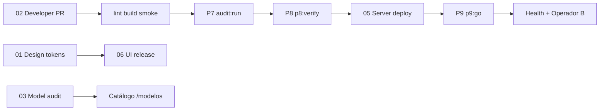

# AGIGOV — Playbook de procesos (estándar interno + terceros)

Índice maestro de **métodos de ejecución** del OS AGIGOV. Cada proceso tiene pasos concretos, herramientas, comandos y criterio de evidencia.

**Regla transversal:** ningún PASS sin prueba (URL, log, artefacto). Ver [00-EVIDENCE-LAW.md](./00-EVIDENCE-LAW.md).

**Superficie producto viva (referencia):** `http://127.0.0.1/`

---

## Mapa por área

| Área | Proceso | Documento | Agente / skill |
|------|---------|-----------|----------------|
| Evidencia (todas) | Ley de evidencia | [00-EVIDENCE-LAW.md](./00-EVIDENCE-LAW.md) | product-market-adviser |
| Diseño UI/UX | Diseño → implementación → release | [01-DESIGN-PROCESS.md](./01-DESIGN-PROCESS.md) | artesano-ui · ui-product-craft |
| Desarrollo | Fork → PR → CI → merge | [02-DEVELOPER-PROCESS.md](./02-DEVELOPER-PROCESS.md) | AGENTS.md |
| Modelos / catálogo | Manifest → audit → publicar | [03-MODEL-LIFECYCLE.md](./03-MODEL-LIFECYCLE.md) | modelo-guardian |
| OS (kernel) | Update · mantenimiento · filtros | [04-OS-UPDATE-MAINTENANCE.md](./04-OS-UPDATE-MAINTENANCE.md) | centinela · production-readiness |
| Servidores / deploy | prod-light · health · rollback | [05-SERVER-DEPLOY-OPS.md](./05-SERVER-DEPLOY-OPS.md) | P8 · P9 |
| UI release | Landing + shell + i18n | [06-UI-UX-RELEASE.md](./06-UI-UX-RELEASE.md) | artesano-ui |
| **Plan maestro sistema** | Producto · diseño · ingeniería · GTM | [PLAN-MAESTRO-SISTEMA.md](../PLAN-MAESTRO-SISTEMA.md) | product-market-adviser |
| Integradores externos | API · sandbox · contrato | [07-INTEGRATOR-GUIDE.md](./07-INTEGRATOR-GUIDE.md) | comercial-agigov |

---

## Gates de calidad (orden recomendado)

| Gate | Comando | Doc |
|------|---------|-----|
| Local rápido | `npm run lint && npm run build` | [02-DEVELOPER-PROCESS.md](./02-DEVELOPER-PROCESS.md) |
| Modelos | `npm run models:audit` | [03-MODEL-LIFECYCLE.md](./03-MODEL-LIFECYCLE.md) |
| Suite audit | `npm run audit:run` | [../P7-AUDIT-GATE.md](../P7-AUDIT-GATE.md) |
| Handshake vivo | `npm run p8:verify` | [../P8-OPS-CI.md](../P8-OPS-CI.md) |
| Release GO | `npm run p9:go` | [../P9-RELEASE-GO.md](../P9-RELEASE-GO.md) |
| Pánico | `npm run panic:drill` | [../PANIC-RUNBOOK.md](../PANIC-RUNBOOK.md) |

---

## Taxonomía de producto (obligatoria en copy y nav)

Ver [../design/TAXONOMY.md](../design/TAXONOMY.md):

- **AGIGOV** = OS (kernel)
- **Modelos** = modelos operativos sobre el OS (no “Apps”, “Productos”, “Resultados” como menú)
- **Consola** = operar un modelo
- **Escritorio** = hub de trabajo
- **Gestión pública** = registro ciudadano publicado

---

## Documentos relacionados (no duplicar aquí)

| Tema | Ruta |
|------|------|
| Roadmap fases | [../PLAN-EJECUCION-FASES.md](../PLAN-EJECUCION-FASES.md) |
| Pre-producción | [../PRE-PRODUCTION.md](../PRE-PRODUCTION.md) |
| Contribución general | [../AGIGOV/CONTRIBUCION.md](../AGIGOV/CONTRIBUCION.md) |
| Model manifest schema | [../AGIGOV/MODEL-MANIFEST-v1.md](../AGIGOV/MODEL-MANIFEST-v1.md) |
| Piloto humano | [../PILOTO-PRUEBA-REAL.md](../PILOTO-PRUEBA-REAL.md) |
| Landing IA internacional | [../design/LANDING-IA-INTL.md](../design/LANDING-IA-INTL.md) |

---

## Para terceros (integradores, gobiernos, builders)

1. Leer [07-INTEGRATOR-GUIDE.md](./07-INTEGRATOR-GUIDE.md)
2. Probar health: `curl http://127.0.0.1/api/public/health`
3. Abrir sandbox: `/institucional/registro` en la PWA
4. Publicar un modelo: [03-MODEL-LIFECYCLE.md](./03-MODEL-LIFECYCLE.md) + [MODEL-MANIFEST-v1.md](../AGIGOV/MODEL-MANIFEST-v1.md)

**Contacto humano:** sección `#contacto` en landing o `/institucional` (no confundir con registro autoservicio).
